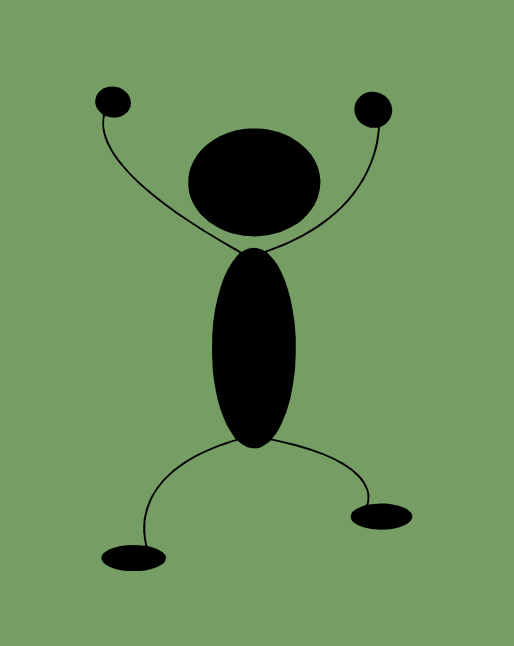
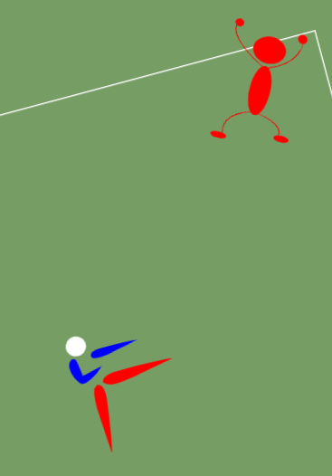

# ScrollAndScroll

Application réalisée dans le cadre du concours S2#1 du Designer du Web

Thème: "ANIMTAION AU SCROLL"

## Table des matières

- [Consignes](#consignes)
- [Réalisation](#réalisation)
  - [Technos](#technos)
  - [Détails](#détails)
- [Screenshots](#screenshots)
- [Theme](#theme)
- [La voir en action](#la-voir-en-action)
- [Moi](#moi)

## Consignes

> Votre travail doit être ORIGINAL et UNIQUE, autant au niveau du DESIGN que du CODE.
> Aucune ressemblance avec quoique ce soit sur le web n'est tolérée, sous peine d'être exclu du concours.
> Partez d'une feuille blanche et tentez de tout créer de A à Z, on doit pouvoir sentir instantanément que tout vient de vous.
>
> Votre création doit également être faite spécialement pour le concours, dans le temps imparti.
> Il est interdit d'utiliser une création qu'on aurait déjà faite, et de participer à un concours avec.
> Ce serait injuste envers ceux qui participent dans le temps imparti.

> Description :
>
> - Les animations au scroll sont très en vogue en ce moment.
> - Elles permettent non seulement de mettre en place une ambiance unique, mais aussi de capter l'attention de l'utilisateur en créant une expérience originale et agréable.
> - Utiliser une librairie n'est pas interdit, mais le but de votre participation est d'être originale et unique, vous ne gagnerez pas beaucoup de points si vous implémentez simplement un exemple de base d'une libraire en exécutant une de ses méthodes.
> - Site classique vs App web
>   Pour ce concours, ça ne fait aucune différence, à vous de voir ce que vous voulez faire, on peut de toute façon créer des animations au scroll dans les deux cas.
> - Votre création doit être réactive(responsive).
> - Essayez également de faire attention aux performances, à l'accessibilité, à la maintenabilité, la compatibilité, etc ... Comme pour un vrai projet !
> - L'utilisation d'SVGs ou de médias pour habiller votre page est recommandée, mais essayez de les créer ou de les personnaliser un maximum de votre côté, avec Figma, Photoshop ou Illustrator par exemple.

## Réalisation

### Technos

- HTML
- CSS
- vanilla JS

### Détails

- Animations en:
  - JS au scroll
- Pas d'intersection observer
- Mouvements en fonction du niveau de scroll calculé

## Screenshots

[UP](#table-des-matières)

## Theme

- Basé sur l'actualité, je me suis amusée, petite animation sans prétention mais qui m'a bien fait manipuler le schmilblick

## La voir en action

- Déploiement: [SrollAndScroll](https://scroll-and-scroll.netlify.app/)

## Moi

- Website - [Bénédicte Hérault](https://lazez-bzh.netlify.app/)
- LinkedIn - [B. HÉRAULT](https://www.linkedin.com/in/benedicte-herault/)

[UP](#table-des-matières)
